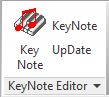

# RevitAddinKeyNoteSystem
The RevitAddinKeyNoteSystem is a Revit add-in that is the Revit ribbon component to the **WpfRevitUserKeynoteManager** application.

In brief, the **WpfRevitUserKeynoteManager** application is a Revit Userkeynote table file editor. It allows more than one person at a time to edit userkeynotes at the same time provided they are each editing different keynote categories. The **WpfRevitUserKeynoteManager** repository is here: (insert link).

### RevitAddinKeyNoteSystem

- 	Adds a custom ribbon panel to the Revit ribbon.

(unfinished documentation)
